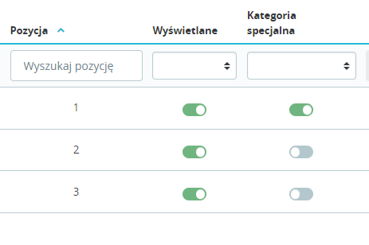
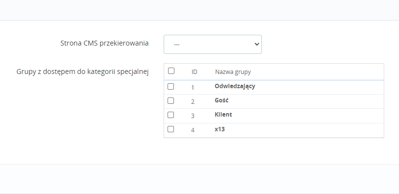
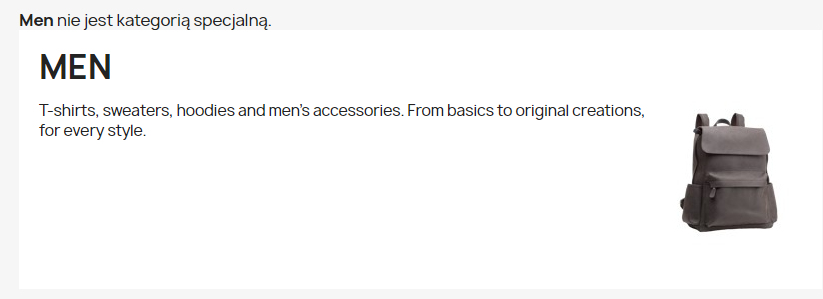
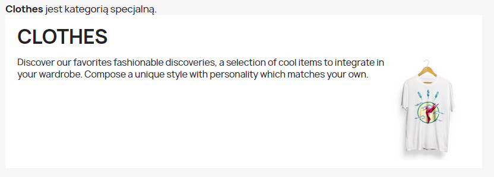

### BackOffice

W BackOffice oznaczamy wybrane kategorie jako specjalne.



W konfiguracji modułu wybieramy stronę CMS przekierowania oraz grupy z dostępem do kategorii specjalnych.



Jeśli w konfiguracji wybierzemy przynajmniej 1 grupę - dostęp do kategorii specjalnych będzie możliwy tylko dla osób 
zalogowanych należących do przynajmniej jednej z tych grup. Nie musi być to grupa domyślna osoby zalogowanej.

### FrontOffice

Przykładowo w pliku 
```themes\classic\templates\catalog\_partials\category-header.tpl``` 

umieszczamy
```{widget name="categoryspecial"}```.





Można użyć w dowolnej templatce, ważne żeby przekazać id_category:

```{widget name="categoryspecial" id_category=ID_CATEGORY}```

